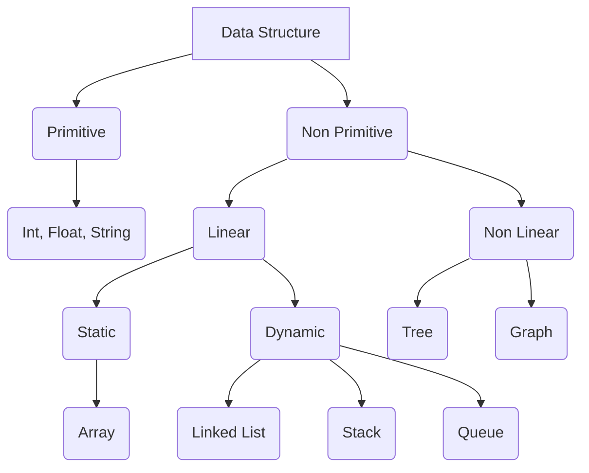

## Data Structure

### Types of Data Structure

1. Primitive and Non Primitive Data Structure
2. Static and Dynamic Data Structure
3. Persistent and Ephemeral data structures

### Non Primitive Data Structure

1. Linear
2. Non Linear

### Persistent Data Structure

1. Parity
2. Fully 
3. Confluently 

### Data Structure Types

